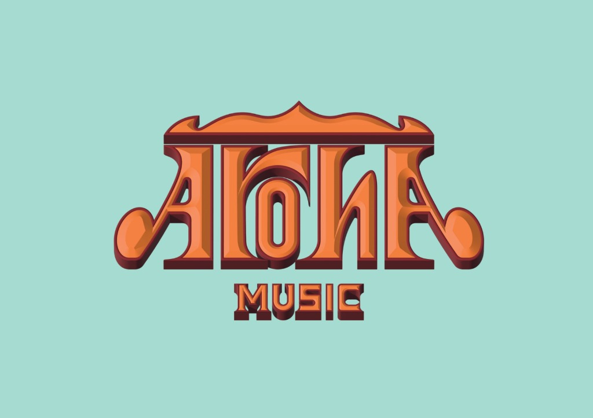

<div align="center">
  <br />
  
  <br />
  <br />

  <h1 style="font-size: 3rem; margin-bottom: 10px;">🎸 AROHA Music</h1>

  <p style="font-size: 1.2rem; color: #555;">
    <strong>The Digital Stage for Soulful Performance</strong>
  </p>

  <p>
    <em>Live Band • Hotels • Bars • Clubs • Private Events</em>
  </p>

  <div align="center">
    
    
    
    
  </div>
</div>

<br />

<p align="center">
  A high-performance, immersive web experience built for <strong>AROHA Music</strong>. <br/>
  Designed to translate the energy of a live gig into a digital format using physics-based interactions and fluid motion.
</p>

<hr />

## ⚡ The Experience

This isn't just a static brochure; it's an interactive application designed with a specific "Retro-Modern" aesthetic.

### 🎨 Visual Engineering
* **Physics-Based Cursor:** A custom spring-physics cursor that reacts magnetically to clickable elements.
* **Smooth Scroll System:** Features scroll-triggered reveals and staggered list animations for a cinematic feel.
* **Interactive Vinyl:** A fully functional, rotating vinyl record player UI component.
* **Parallax Depth:** Floating geometric shapes in the hero section create a sense of 3D space.

### 🛠 Technical Highlights
* **Component Architecture:** Modular React structure for easy scalability (e.g., adding new band members or tour dates).
* **Performance:** Powered by **Vite** for instant HMR and optimized production builds.
* **Responsive Engine:** Fluid layouts that adapt seamlessly from 4K desktops to mobile devices.

---

## 📸 Snapshots

| **Hero Section** | **Vinyl Player** |
|:---:|:---:|
|  |  |

---

## 🚀 Quick Start

Get the local environment spinning in seconds.

```bash
# 1. Clone the repository
git clone [https://github.com/yourusername/aroha-music.git](https://github.com/yourusername/aroha-music.git)

# 2. Enter the stage
cd aroha-music

# 3. Install dependencies
npm install

# 4. Soundcheck (Start Dev Server)
npm run dev

```

> The app will go live at [http://localhost:5173](https://www.google.com/search?q=http://localhost:5173)

---

## 📂 Architecture

A clean, modular structure designed for maintainability.

```bash
aroha/
├── 📂 public/             # Static assets (Logos, Icons)
├── 📂 src/
│   ├── 📂 components/     # UI Building Blocks
│   │   ├── 🖱️ CustomCursor.jsx  # Physics interactions
│   │   ├── 🎵 Music.jsx         # Audio logic & Vinyl UI
│   │   ├── 🦸 Hero.jsx          # Intro animations
│   │   └── ... (Band, Venues, Contact)
│   ├── App.jsx            # Layout orchestration
│   ├── main.jsx           # DOM Entry
│   └── index.css          # Tailwind/Global Styles
└── vite.config.js         # Build configuration

```

---

## 🎨 Design System

The UI follows a strict "Warm Retro" palette to match the band's identity.

| Token | Hex | Role | Visual |
| --- | --- | --- | --- |
| **Primary** | `#7ECEC5` | Backgrounds / Hero | 🌊 |
| **Accent** | `#E8A87C` | CTAs / Highlights | 🧡 |
| **Focus** | `#E27D60` | Hover States | 🔶 |
| **Surface** | `#FFF8F0` | Content Cards | 🍦 |

---

## 🛠️ Built With

* **[React 18](https://react.dev/)** - Core UI Library
* **[Vite](https://vitejs.dev/)** - Next Gen Frontend Tooling
* **[Framer Motion](https://www.framer.com/motion/)** - Production-ready animation library
* **[Outfit & Playfair](https://fonts.google.com/)** - Typography

---

## 🤝 Contributing

Got an idea to make the stage brighter?

1. Fork the project
2. Create your feature branch (`git checkout -b feature/AmazingFeature`)
3. Commit your changes (`git commit -m 'Add some AmazingFeature'`)
4. Push to the branch (`git push origin feature/AmazingFeature`)
5. Open a Pull Request

---

<div align="center">
<br />
<p>Licensed under MIT.</p>
<p>
Made with 🧡 & 🎵 for <strong>AROHA Music</strong>
</p>
<p style="font-size: 0.8rem; opacity: 0.7;">
<em>Developed by a passionate web developer.</em>
</p>
</div>
